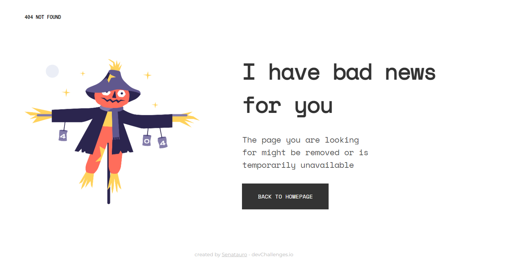

<!-- Please update value in the {}  -->

<h1 align="center">Simple React 404 page </h1>

   Solution for a challenge from  <a href="http://devchallenges.io" target="_blank">Devchallenges.io</a>.

  <h3>
    <a href="https://master--magical-cat-5d5001.netlify.app/">
      Demo
    </a>
     | 
    <a href="https://devchallenges.io/solutions/tXtCsrElCimcXpDjhFxo">
      Solution
    </a>
     | 
    <a href="https://devchallenges.io/challenges/wBunSb7FPrIepJZAg0sY">
      Challenge
    </a>
  </h3>

<!-- TABLE OF CONTENTS -->

## Table of Contents

- [Overview](#overview)
  - [Built With](#built-with)
- [Features](#features)
- [Contact](#contact)

<!-- OVERVIEW -->

## Overview

This is a simple 404 page made for the devchallenges.io 1° responsive web developer challenge. This is the first challenge that I undertook from the [DevChallenges](https://devchallenges.io/challenges) website. I always had a hard time with responsive web development, and taking this challenge as a test gave me the change to train more on the responsive side of things and to learn more about the responsive web development.

Introduce your projects by taking a screenshot or a gif. Try to tell visitors a story about your project by answering:

- Where can I see your demo? [Here](https://master--magical-cat-5d5001.netlify.app/)
- What was your experience? UP
- What have you learned/improved? UP
- Your wisdom? Responsive web dev is hard

### Built With

<!-- This section should list any major frameworks that you built your project using. Here are a few examples.-->

- [React](https://reactjs.org/)

## Features

<!-- List the features of your application or follow the template. Don't share the figma file here :) -->

This application/site was created as a submission to a [DevChallenges](https://devchallenges.io/challenges) challenge. The [challenge](https://devchallenges.io/challenges/wBunSb7FPrIepJZAg0sY) was to build an application to complete the given user stories.

## Contact

- Website [https://senatauro.github.io/](https://senatauro.github.io/)
- GitHub [@Senatauro](https://github.com/Senatauro)